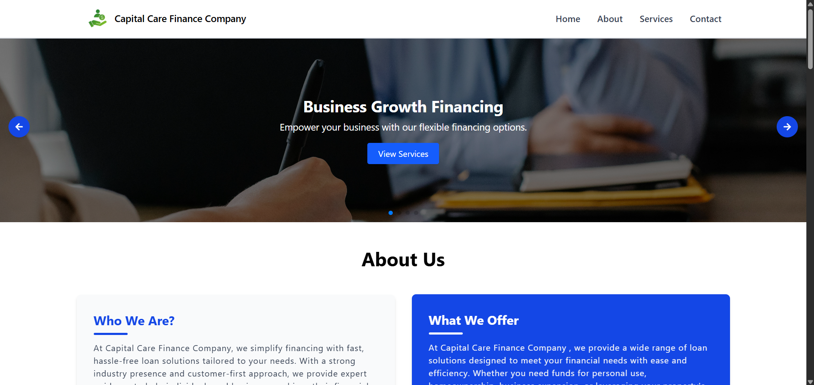
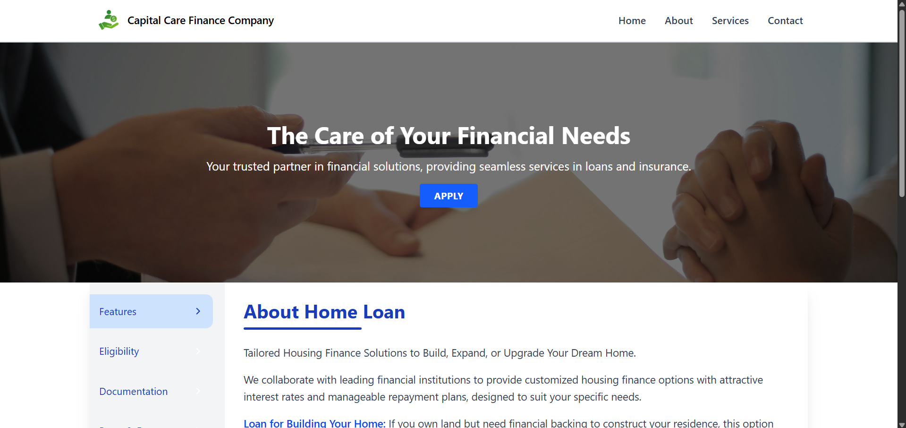
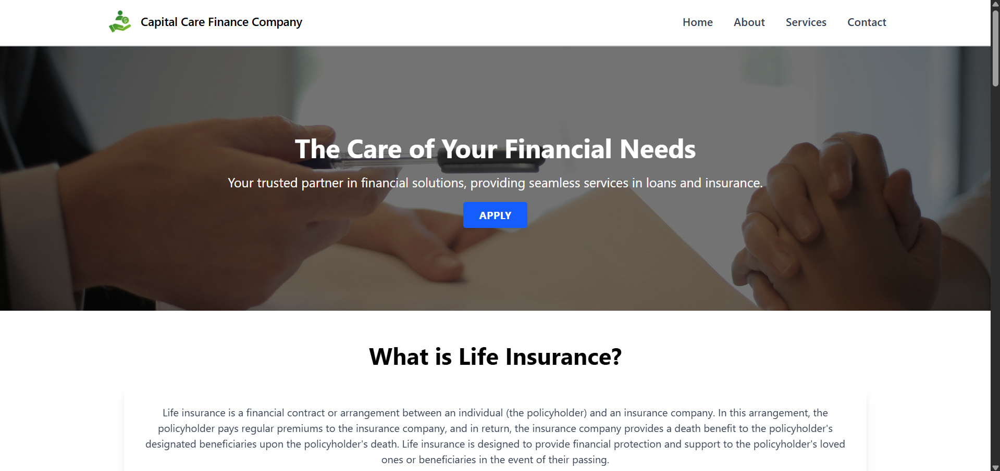
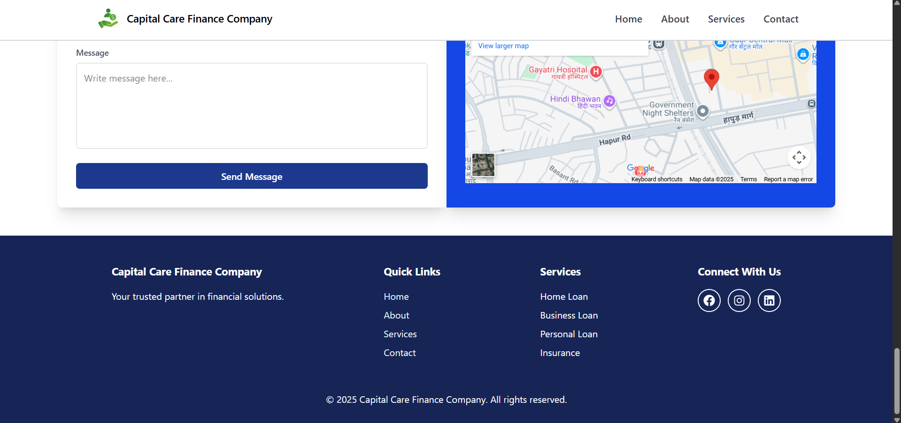

# 💼 Capital Care Finance Company - Website Redesign

A modern, fully responsive website redesign for **Capital Care Finance Company**, built using **React JS** and **Tailwind CSS**. <br />
This project focuses on delivering a clean UI, smooth user experience, reusable components, and seamless navigation with beautiful scroll animations.

---
## 📸 Screenshots

| Preview 1 | Preview 2 |
|------------|------------|
|  |  |

| Preview 3 | Preview 4 |
|------------|------------|
|  |  |

---

## 🌐 Live Demo  

The project is live and can be viewed here: [Capital Care](https://capital-care.vercel.app/)

---

## ✨ Features

- 📱 Fully Responsive Design across all devices
- ⚛️ Built with React JS + Tailwind CSS
- 🔗 Smooth scrolling using react-scroll
- 🧭 Page navigation powered by react-router-dom
- 🎨 Stylish icons via react-icons
- 🌀 Interactive carousels built with SwiperJS
- ✨ Beautiful scroll animations using AOS
- ♻️ Reusable and modular component structure
- 📊 Data-driven UI rendering using .map() for scalability

---

## 🧱 Technologies Used

| Tech               | Usage                                   |
|--------------------|------------------------------------------|
| **React JS**       | Frontend library                         |
| **Tailwind CSS**   | Utility-first CSS framework              |
| **React Router**   | Routing between pages                    |
| **React Scroll**   | Smooth in-page scrolling                 |
| **React Icons**    | Icon support across UI                   |
| **SwiperJS**       | Sliders and carousel support             |
| **AOS**            | Animation on scroll                      |

---

## 🧠 What I Learned

- Designing UI using Tailwind’s responsive utilities
- Creating reusable, prop-based components
- Integrating third-party libraries smoothly into React
- Structuring a scalable folder and component layout
- Enhancing user interactions using scroll effects and sliders
- Improving routing in single-page applications

---

## 📁 Installation & Setup

```bash
# Clone the repository
git clone https://github.com/TonyStark-19/Capital-care.git

# Navigate into the project
cd Capital-care

# Install dependencies
npm install

# Start the development server
npm run dev
```
---

🙌 Made with ❤️ by Aditya Chandel

If you have any suggestions or feedback, feel free to reach out or open an issue. Always learning, always improving! 🚀
